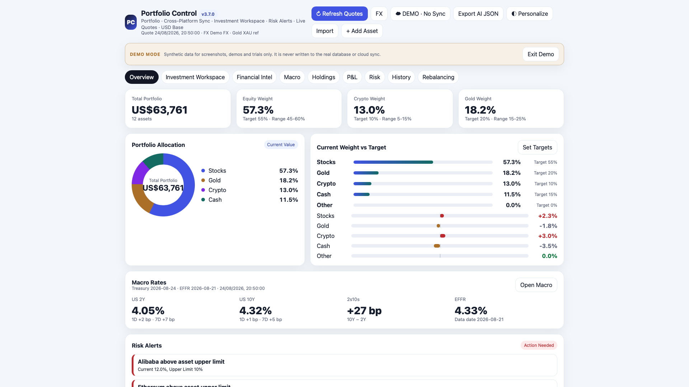
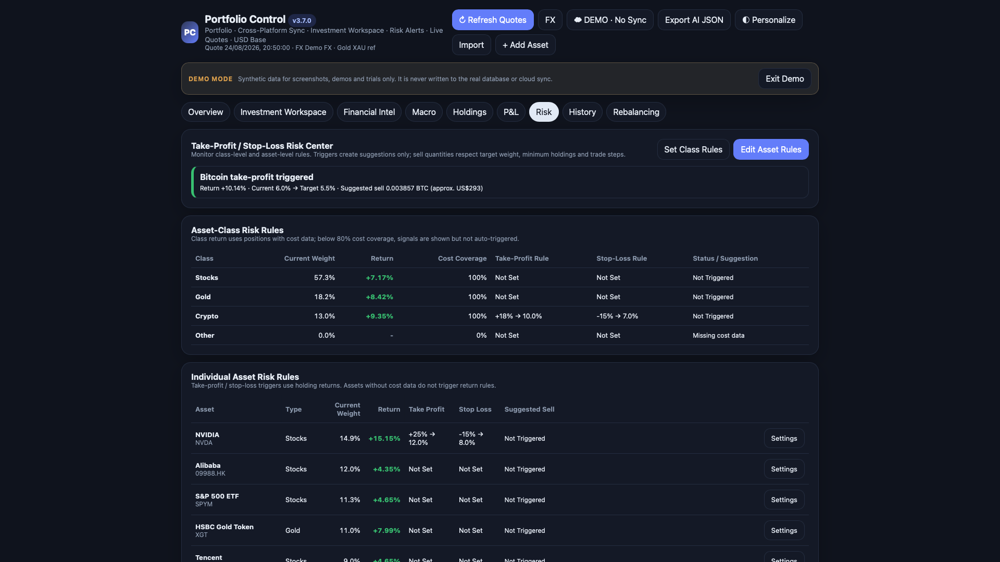
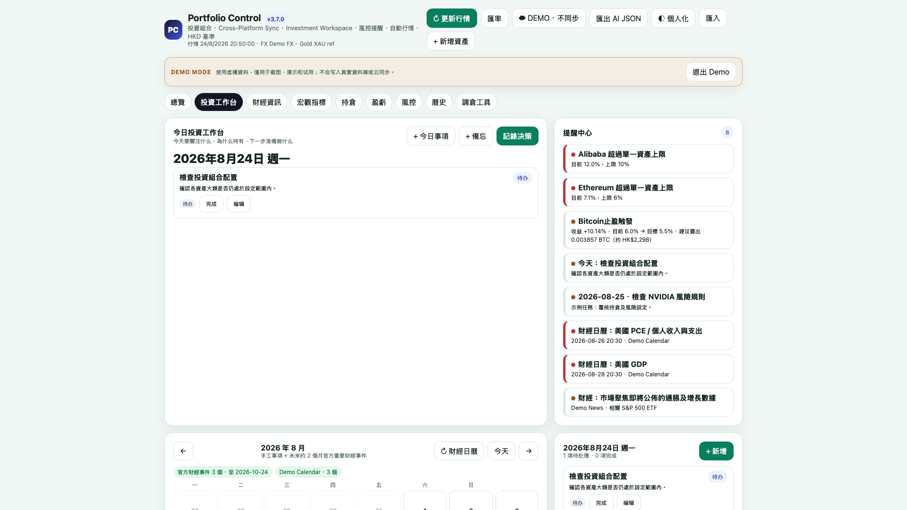
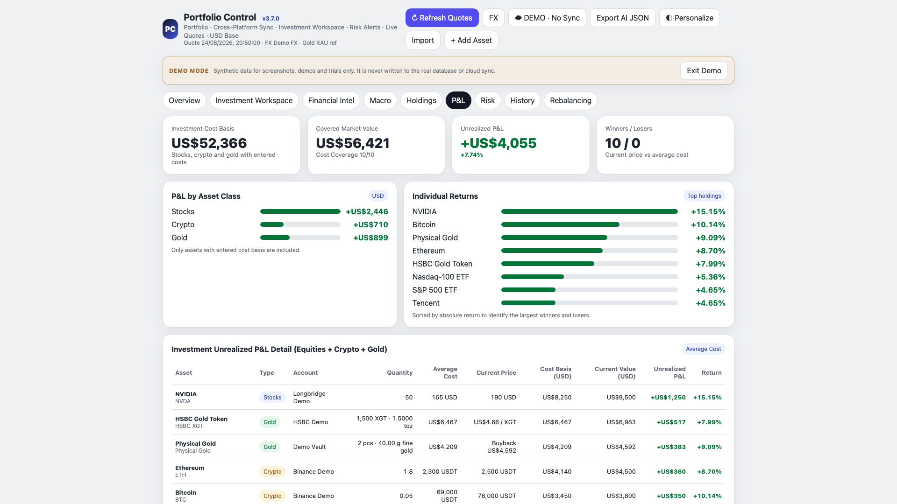
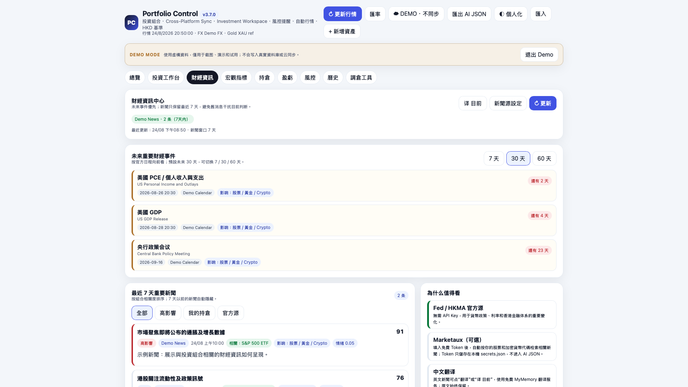
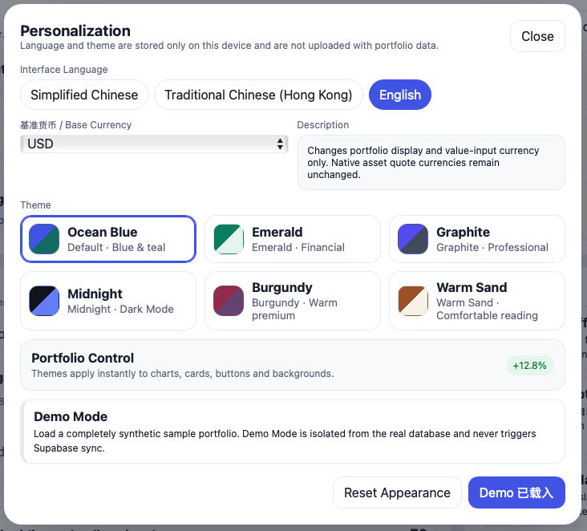

# Portfolio Control

<p align="center">
  <strong>A local-first, cross-platform portfolio management workstation.</strong>
</p>

<p align="center">
  Stocks · ETFs · Crypto · Gold · Cash · Rebalancing · Risk Control · Financial Calendar · Macro Indicators
</p>

<p align="center">
  <a href="https://github.com/HuntsMan2078/Portfolio-Control/stargazers">
    
  </a>
  <a href="https://github.com/HuntsMan2078/Portfolio-Control/blob/main/LICENSE">
    
  </a>
  
  
  
</p>

<p align="center">
  <a href="#features">Features</a> ·
  <a href="#architecture">Architecture</a> ·
  <a href="#privacy--security">Privacy</a> ·
  <a href="#繁體中文">繁體中文</a> ·
  <a href="https://github.com/HuntsMan2078/Portfolio-Control/releases">Releases</a>
</p>

---

## What is Portfolio Control?

Portfolio Control is a personal investment portfolio management desktop application for people who want more than a simple profit-and-loss tracker.

Most portfolio trackers answer:

> How much did my portfolio gain today?

Portfolio Control focuses on another question:

> **Is my portfolio still following the allocation and risk rules I originally designed?**

Market movements continuously change portfolio weights even when no trades are made.

Portfolio Control brings stocks, cryptocurrency, gold and cash into one local-first workspace, with tools for:

- Portfolio allocation
- Rebalancing
- Risk control
- Watchlists
- Investment notes
- Financial calendars
- Macro indicators
- Optional encrypted cross-device synchronization

---

# Features

## 🌐 Multilingual UI & Personalization

Portfolio Control v3.7 adds device-local interface personalization without mixing UI preferences into portfolio sync data.

Interface languages:

- Simplified Chinese
- Traditional Chinese (Hong Kong)
- English

Built-in themes:

- Ocean Blue
- Emerald
- Graphite
- Midnight
- Burgundy
- Warm Sand

Language and theme preferences stay on the current device, so different computers can use different interfaces while sharing the same portfolio data.

### Demo Mode

A synthetic demo portfolio can be loaded for screenshots, product demonstrations and first-time exploration. Demo Mode is isolated from the real SQLite portfolio state and does not trigger Supabase synchronization.

---

## 📊 Multi-Asset Portfolio

Manage multiple asset types inside one portfolio.

Supported categories include:

- Stocks
- ETFs
- Cryptocurrency
- HSBC Gold Token (XGT)
- Physical gold
- HKD / USD / USDT cash
- Manually managed assets

Each position can track information such as:

- Quantity
- Average cost
- Market value
- Unrealized P/L
- Return
- Portfolio weight
- Target allocation
- Allocation limits
- Take-profit rules
- Stop-loss rules
- Minimum holding quantity

---

## 💱 Multi-Currency Base

Portfolio Control separates **native asset currency** from the **portfolio base currency**.

Supported display/base currencies include:

- HKD
- USD
- CNY
- EUR
- GBP
- SGD
- JPY
- AUD
- CAD
- CHF

Changing the base currency changes portfolio totals, P&L, history, risk suggestions and value-based rebalancing inputs without rewriting native quotes. For example, a Tencent position may keep its quote in HKD while the total portfolio is displayed in USD.

Base currency is a local device preference and is not part of cloud portfolio sync.

---

## 🎯 Two-Level Allocation Management

Portfolio Control supports allocation rules at both:

1. **Asset-class level**
2. **Individual-asset level**

Example:

```text
Portfolio
├── Stocks                     55%
│   ├── NVDA                    8%
│   ├── SPYM                    7%
│   ├── Hong Kong Stocks
│   └── Other Stocks
│
├── Gold                       20%
│   ├── HSBC Gold Token
│   └── Physical Gold
│
├── Crypto                     10%
│   ├── BTC
│   └── Other Crypto
│
└── Cash                       15%
```

This makes it possible to define rules such as:

- Total stock exposure should remain around 55%
- Gold should remain around 20%
- NVDA itself should remain around 8%
- BTC should stay below a defined portfolio weight

Portfolio Control can also detect conflicting allocation targets.

---

## ⚖️ Rebalancing Engine

Portfolio Control includes rule-based rebalancing tools.

### Cash Rebalancing

Use available cash to increase underweight positions.

### Internal Rebalancing

Rebalance between existing investment assets while excluding cash.

The engine can identify:

1. Overweight assets
2. Underweight assets
3. Profitable positions that may be suitable for trimming
4. Minimum-holding restrictions
5. Remaining allocation gaps

It then estimates how overweight investments could fund underweight investments.

### External Capital Planning

Estimate how much new capital would be required to move the portfolio toward a target allocation without selling existing holdings.

---

## 🛡️ Risk Control

Risk rules can be configured at both:

- Asset-class level
- Individual-asset level

Supported logic includes:

- Take-profit thresholds
- Stop-loss thresholds
- Target allocation after a trigger
- Minimum holding quantities
- Estimated sell quantities

Example calculation flow:

```text
Risk Trigger
     ↓
Current Allocation
     ↓
Desired Post-Trigger Allocation
     ↓
Current Market Price
     ↓
Estimated Sell Quantity
```

Trade constraints are respected where possible.

For example, a stock position with only one remaining share can be excluded from automatic sell recommendations.

All rebalancing and risk outputs are analytical suggestions only.

---

## 📈 Market Data

Portfolio Control can obtain market information from multiple sources.

### Longbridge

Used for supported US and Hong Kong stock quotes.

Depending on account permissions and the current trading session, available prices may include:

- Regular session
- Pre-market
- Post-market
- Overnight session

Longbridge authorization remains local to the device.

### Binance

Used for supported cryptocurrency market prices.

Examples include:

- BTC
- ETH
- SOL
- Other supported crypto assets

Stablecoins such as USDT are handled separately rather than being treated as invalid pairs such as `USDTUSDT`.

---

## 🥇 Gold Management

Portfolio Control treats gold as a complete asset class.

### HSBC Gold Token (XGT)

Supported information can include:

- XGT quantity
- Cost basis
- Fine-gold equivalent
- Estimated liquidation value
- Portfolio allocation
- Profit / loss

Where available, realizable bank buyback value can be used instead of only relying on theoretical spot value.

### Physical Gold

Physical gold holdings can also be recorded.

Examples:

- Gold bars
- Coins
- Different weights
- Different purities

Tracked fields can include:

- Number of pieces
- Unit weight
- Weight unit
- Purity
- Fine-gold weight
- Acquisition cost
- Estimated resale value

Tokenized gold and physical gold can then be aggregated into one Gold asset class.

---

## 🧭 Investment Workspace

Portfolio Control also acts as an investment decision workspace.

Tools include:

- Investment calendar
- Daily tasks
- Reminder center
- Memos
- Investment thesis
- Research notes
- Decision journal
- Watchlist

Notes and decisions can be associated with specific assets.

The goal is to preserve both:

> What did I buy?

and:

> Why did I buy it?

---

## 👀 Watchlist

Assets do not need to be held before they can be monitored.

The Watchlist can track:

- Current price
- Watch price
- Distance to target price
- Holding status
- Quote source
- Quote timestamp

Supported symbols can use available Longbridge or Binance market data.

---

## 🗓️ Financial Calendar

Portfolio Control can track important upcoming macroeconomic events.

Examples include:

- FOMC meetings
- CPI
- PCE
- Non-Farm Payrolls
- GDP releases
- Other major economic events

Future scheduled events are separated from recent financial news so that old news does not dominate the dashboard.

---

## 🌎 Macro Indicators

Portfolio Control currently supports selected macro indicators including:

- US 2-Year Treasury Yield
- US 10-Year Treasury Yield
- 2s10s Yield Spread
- Effective Federal Funds Rate (EFFR)

The interface can display:

- Current values
- Daily changes
- Weekly changes
- Monthly changes
- Historical trends
- Basis-point movements

---

## 📰 Financial Information

Portfolio Control can aggregate information from official and optional third-party sources.

Examples include:

- Federal Reserve
- Hong Kong Monetary Authority
- US Treasury
- Optional financial-news providers

Recent news and future scheduled economic events are handled separately.

Optional translation can also be used for English financial information.

---

# 🔐 Local-First by Design

Portfolio Control is designed around a local-first architecture.

Core portfolio functionality remains usable even when cloud synchronization is unavailable.

```text
             Portfolio Control
                    │
                    ▼
             Local SQLite DB
                    │
        ┌───────────┼───────────┐
        │           │           │
     Holdings     Rules       Workspace
        │           │           │
     History     Calendar     Watchlist
```

Portfolio data is stored locally using SQLite.

---

## ☁️ Optional Cross-Device Sync

Cloud synchronization is optional.

Portfolio Control can use Supabase as a synchronization layer between devices.

```text
       Windows
          │
          ▼
    Local SQLite
          │
          ▼
Encrypted Portfolio State
          │
          ▼
       Supabase
          │
          ▼
Encrypted Portfolio State
          │
          ▼
    Local SQLite
          │
          ▼
        macOS
```

Each device retains its own local database.

Sensitive credentials such as broker OAuth credentials and third-party API tokens are intended to remain local to each device.

---

# Architecture

A simplified architecture:

```text
                    ┌────────────────────┐
                    │ Portfolio Control  │
                    └─────────┬──────────┘
                              │
            ┌─────────────────┼─────────────────┐
            │                 │                 │
            ▼                 ▼                 ▼
       Portfolio          Investment          Macro
        Engine            Workspace            Data
            │                 │                 │
            └─────────────────┼─────────────────┘
                              │
                              ▼
                       Local SQLite
                              │
                 ┌────────────┴────────────┐
                 │                         │
                 ▼                         ▼
          Local-Only Data          Optional Sync
                                           │
                                           ▼
                                        Supabase
```

External data integrations can include:

```text
Longbridge ─────────┐
Binance ────────────┤
US Treasury ────────┤
Federal Reserve ────┤──► Portfolio Control
HKMA ───────────────┤
Optional News ──────┘
```

---

# 🤖 AI-Friendly Portfolio Export

Portfolio Control can export portfolio state as structured JSON.

An export may contain information such as:

- Holdings
- Asset allocation
- Cost basis
- Profit / loss
- Target weights
- Risk rules
- Rebalancing configuration
- Calendar events
- Watchlist
- Investment notes
- Decision records
- Macro indicators
- Portfolio alerts

The JSON can then be provided to an AI system for additional portfolio analysis.

Credentials and application secrets should remain excluded from AI exports.

---

# Privacy & Security

Portfolio Control is designed to minimize unnecessary exposure of personal financial information.

Sensitive local files are excluded from the source repository, including:

```text
portfolio.db
*.db
*.db-wal
*.db-shm

secrets.json

.env
.env.*

backups/
exports/
```

The repository should never contain:

- Personal portfolio databases
- Broker OAuth credentials
- API tokens
- Supabase service-role secrets
- Portfolio synchronization passwords
- Private investment exports

Before public releases, the repository can also be checked using tools such as Gitleaks.

See [SECURITY.md](SECURITY.md) for details.

---

# 🖥️ Platforms

## macOS

Portfolio Control supports macOS desktop packaging.

For source builds:

```bash
chmod +x build_macos.sh
./build_macos.sh
```

Prebuilt packages will be published through:

[GitHub Releases](https://github.com/HuntsMan2078/Portfolio-Control/releases)

---

## Windows

Portfolio Control also supports Windows desktop deployment.

Prebuilt Windows installers will be published through:

[GitHub Releases](https://github.com/HuntsMan2078/Portfolio-Control/releases)

---

# 📸 Screenshots

# 📸 Screenshots

## Portfolio Dashboard

A unified overview of portfolio allocation, target weights, macro indicators and risk alerts.



## Risk Control

Rule-based take-profit, stop-loss and position-management suggestions.



## Investment Workspace

Calendar, reminders, portfolio events and investment decision tracking.



## Multi-Asset P&L

Unified cost basis and unrealized profit and loss across stocks, cryptocurrency and gold.



## Financial Intelligence

Upcoming macroeconomic events and portfolio-relevant financial information.



## Personalization

Portfolio Control supports:

- Simplified Chinese
- Traditional Chinese (Hong Kong)
- English
- Multiple portfolio base currencies
- Six visual themes



---

# 🚀 Roadmap

Potential future improvements include:

- Transaction ledger
- Automatic cost-basis calculation
- Dividend tracking
- Portfolio performance attribution
- Additional brokers
- More market-data providers
- Additional macroeconomic indicators
- Improved cloud conflict handling
- More advanced portfolio analytics
- Better localization
- Additional languages
- Mobile companion interface
- Automated tests
- Improved installer signing and distribution

---

# 🤝 Contributing

Contributions are welcome.

Useful contribution areas include:

- Bug fixes
- Market-data integrations
- Portfolio analytics
- Risk-control logic
- Rebalancing improvements
- UI / UX
- macOS packaging
- Windows packaging
- Documentation
- Translation
- Testing
- Financial calendar improvements
- Macro indicator support

Please read [CONTRIBUTING.md](CONTRIBUTING.md) before opening a Pull Request.

---

# ⭐ Support the Project

If Portfolio Control is useful or interesting to you, consider giving the repository a **Star ⭐**.

Stars help more people discover the project and support continued development.

---

# 繁體中文

## Portfolio Control 是甚麼？

Portfolio Control 是一款面向個人投資者的 **本地優先、多資產、跨平台投資組合管理工具**。

一般投資組合工具主要回答：

> 今天賺了多少？

Portfolio Control 更關注：

> **我的投資組合是否仍然符合原本設定的資產配置與風險規則？**

即使完全沒有交易，市場價格變動亦會持續改變股票、黃金、加密貨幣及現金在整個投資組合中的比重。

Portfolio Control 希望把這些資訊集中在一個桌面工作區內管理。

---

## 主要功能

### 📊 多資產管理

目前可管理：

- 美股
- 港股
- ETF
- 加密貨幣
- HSBC Gold Token（XGT）
- 實物黃金
- HKD / USD / USDT 現金
- 其他手動管理資產

每項資產可以記錄：

- 持有數量
- 平均成本
- 市值
- 未實現盈虧
- 回報率
- 投資組合佔比
- 目標倉位
- 上下限
- 止盈規則
- 止損規則

---

### 💱 多幣種基準貨幣

Portfolio Control 會把 **資產原始報價幣種** 與 **投資組合基準貨幣** 分開處理。

目前支援 HKD、USD、CNY、EUR、GBP、SGD、JPY、AUD、CAD 及 CHF。

切換基準貨幣後，總資產、盈虧、歷史、風控建議及按市值調倉的輸入都會跟隨轉換，但個別資產的原始報價幣種不會被改寫。基準貨幣屬於本機顯示偏好，不會跟隨投資組合上傳雲端。

---

### 🎯 兩層資產配置

Portfolio Control 同時支援：

**資產大類目標**

例如：

```text
股票      55%
黃金      20%
加密貨幣  10%
現金      15%
```

以及：

**單一資產目標**

例如：

```text
NVDA       8%
SPYM       7%
BTC        5%
XGT       10%
```

因此可以同時控制：

- 股票整體不要過重
- 黃金保持一定比例
- 某一隻股票不要佔整個投資組合過多
- BTC 不超過指定風險水平

系統亦可以檢查不同目標之間是否互相衝突。

---

### ⚖️ 調倉

Portfolio Control 提供多種調倉思路。

#### 現金調倉

使用現有現金補充低於目標的資產。

#### 投資資產內部調倉

不使用現金。

系統會先識別：

- 超配資產
- 低配資產
- 可考慮減持的盈利資產
- 最低持有數量限制
- 尚未解決的配置缺口

再估算由哪些超配資產向低配資產轉移。

#### 新增資金

亦可以估算：

> 如果不賣任何現有持倉，需要再投入多少新資金才能接近目標配置？

---

### 🛡️ 風險控制

可以在：

- 資產大類
- 單一資產

兩個層級設定：

- 止盈
- 止損
- 觸發後目標倉位
- 最低持有數量
- 建議賣出數量

例如只剩一股的股票，可以設定為不納入自動減倉建議。

所有結果只屬分析及決策輔助，不會自動執行交易。

---

### 📈 股票及加密貨幣行情

股票行情可透過 Longbridge 支援的市場資料取得，包括美股與港股。

根據帳戶權限及交易時段，可能取得：

- 正常交易時段
- 盤前
- 盤後
- Overnight

Longbridge 的授權資訊保留在本機。

加密貨幣行情則可透過 Binance 公開市場資料取得。

---

### 🥇 黃金

黃金可以作為完整資產大類管理。

支援：

#### HSBC Gold Token

例如：

- XGT 數量
- 成本
- 純金等值
- 估算套現價值
- 盈虧
- 投資組合佔比

#### 實物黃金

例如：

- 金條
- 金幣
- 件數
- 重量
- 純度
- 純金重量
- 買入成本
- 估算回收價值

XGT 及實物黃金最後可合併計算整體黃金倉位。

---

### 🧭 投資工作區

Portfolio Control 不只記錄持倉，亦保留投資決策脈絡。

包括：

- 投資日曆
- 今日任務
- 提醒中心
- 備忘錄
- Investment Thesis
- 研究筆記
- 決策日誌
- Watchlist

希望除了記錄：

> 我買了甚麼？

亦能記錄：

> 我當時為甚麼買？

---

### 🗓️ 財經日曆

可以集中關注未來的重要經濟事件，例如：

- FOMC
- CPI
- PCE
- Non-Farm Payrolls
- GDP
- 其他重要宏觀數據

近期新聞與未來事件分開處理，避免過期新聞佔據整個投資工作區。

---

### 🌎 宏觀指標

目前可加入：

- 美國 2 年期國債收益率
- 美國 10 年期國債收益率
- 2s10s 利差
- Effective Federal Funds Rate

並查看：

- 最新值
- 單日變化
- 一週變化
- 一個月變化
- 基點變化
- 歷史走勢

---

## 🔐 本地優先

Portfolio Control 採用 Local-First 設計。

核心投資資料保存在本機 SQLite。

即使沒有雲端服務，主要投資組合功能仍然可以使用。

---

## ☁️ 可選跨裝置同步

如有需要，可以使用 Supabase 作為 Windows 與 macOS 之間的同步層。

每部裝置仍然保留自己的 SQLite 資料庫。

同步資料可以在上傳前進行加密。

Longbridge OAuth、第三方 API Token 等敏感憑證應保留在各自裝置本機。

---

## 🔒 私隱

以下資料不應提交到 GitHub：

- 個人投資資料庫
- Longbridge OAuth 憑證
- API Token
- Supabase Service Role Key
- Portfolio Sync Password
- 個人投資 JSON 匯出
- 備份資料

詳細內容請參閱 [SECURITY.md](SECURITY.md)。

---

## 🤖 AI JSON 匯出

Portfolio Control 可以輸出結構化 JSON，包括：

- 持倉
- 資產配置
- 成本
- 盈虧
- 目標倉位
- 風險規則
- 調倉設定
- 財經日曆
- Watchlist
- 投資筆記
- 決策紀錄
- 宏觀指標
- 提醒

可以把這個 JSON 提供給 AI 作進一步分析。

API Token、OAuth 憑證及其他 Secret 不應包含在匯出資料內。

---

## 🖥️ 平台

目前主要支援：

- macOS
- Windows

正式安裝包將透過 GitHub Releases 發佈。

---

## ⭐ 支持項目

如果你覺得 Portfolio Control 有用，歡迎給這個 Repository 一個 **Star ⭐**。

Star 可以讓更多人發現這個項目，也能支持後續持續開發。

---

# ⚠️ Disclaimer

Portfolio Control is a portfolio-management and analysis tool.

It does not provide financial, investment, tax or legal advice.

It does not guarantee the accuracy, timeliness or completeness of external market data.

Rebalancing, take-profit and stop-loss calculations are analytical suggestions only.

Portfolio Control does not automatically execute investment trades.

Users remain responsible for all investment decisions.

---

# 📄 License

Portfolio Control is released under the MIT License.

See [LICENSE](LICENSE).
